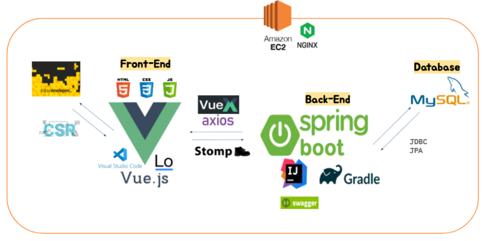
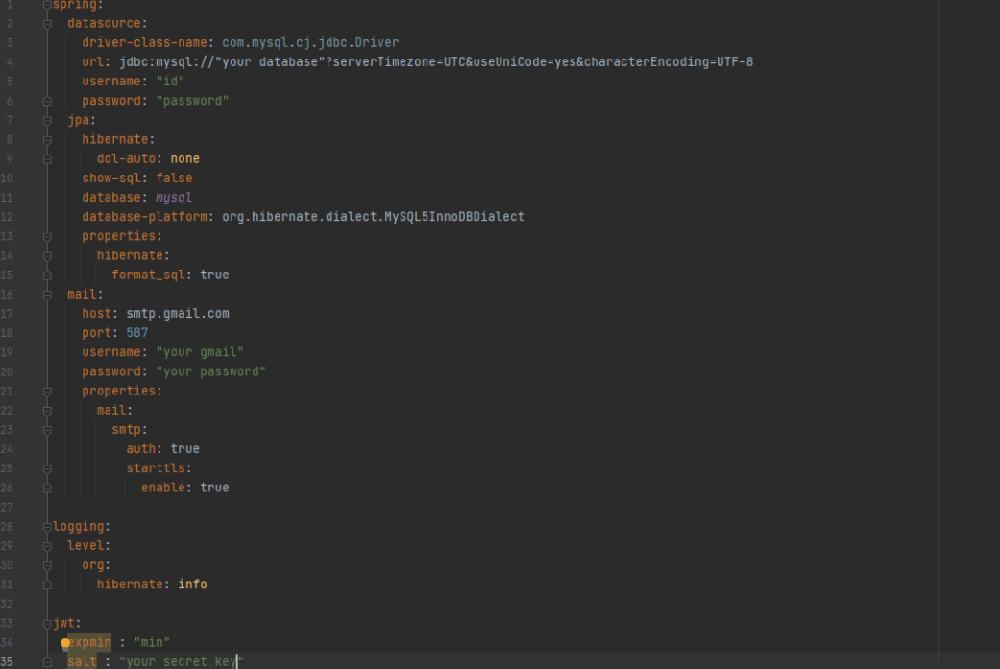

# 나의 이웃 테두리 : 나이테

> 프로젝트명 - 나의 이웃 테두리 : 나이테


## 나이테-로고


## 나이제 주제

> 1인 가구를 위해 편리한 동네생활을 제공해주는 플랫폼


## 참여자

### 백엔드개발자

 - 김민경 [Github 바로가기](https://github.com/minkyoe)

 - 0445187_이유진 [Github 바로가기](https://github.com/leejjin)
 - 0448358_조성훈[Github 바로가기](https://github.com/JoChoSunghoon)


###  프론트엔드 개발자
- 0448767_이동희 [Github 바로가기](https://github.com/Donghee-L)
 - 0447329_박주동 [Github 바로가기](https://github.com/judong93)


## 기능소개

#### 1)  1대1 채팅기능


#### 2) 공동구매/중고거래


#### 3)  검색기능


#### 4) 신뢰도

​	(1) 신고


​	(2) 상호평가


## 플랫폼

Gitlab, Jira, Slack, Vuejs, Spring boot, Mysql


## 개발언어

Java, JavaScript,CSS,HTML


## 개발환경

VS Code, Intellij, Mysql Workbench, AWS EC2, NginX


## 기술 아케텍처




## 설치방법


### 1) Backend

​	(1) Backendmysql workbench를 통해 naite.mwb로 데이터베이스 생성



​	(2) resources밑에 application.yml을 자신의 정보에 맞게 입력하고 저장

​	(3) assign data source and build project

​	(4) run NaiteApplication.java

​	


### 2) Frontend

​	

​	(1) Project Setup

``` bash
$ npm install
```

​	

​	(2) Compiles and hot-reloads for development

``` bash
/Basic port/
$ npm run serve 

/Change port/
$ npm run serve -- --port ${SERVER_PORT}
```


## 기타사항

[나이테 시연영상](https://youtu.be/fQ2vkrXv5J8?list=LL)


