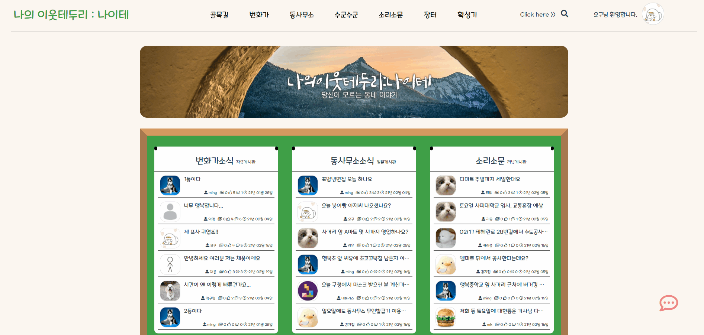
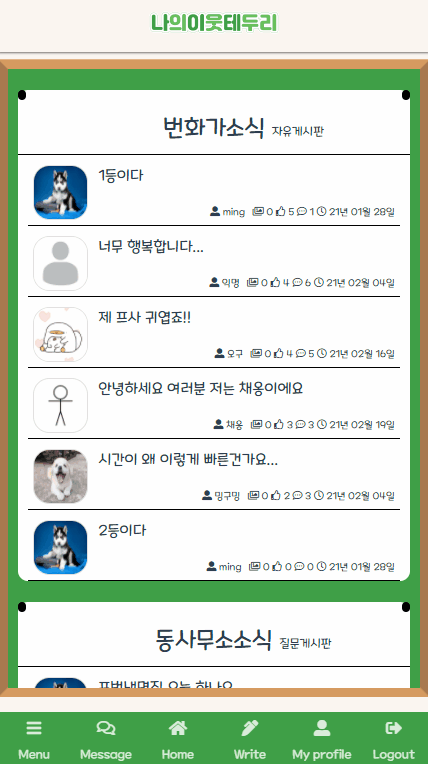
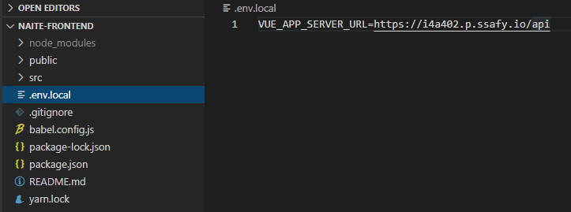

# 나의 이웃 테두리 : 나이테

## 1. 목차

[toc]

## 2. 나이테 기획 의도 및 소개

 - '나의 이웃 테두리 : 나이테'는 1인 가구에게 편리한 동네 생활을 제공하는 플랫폼입니다.
 - 나이테는 사용자에게 동네 정보 공유, 공동  구매, 이웃과의 소통을 가능하게 하여 보다 더 편리한 동네 생활을 제공하고자 합니다.
 - 이를 통해 사용자가 동네의 사적인 정보를 공유하거나, 혼자 사기엔 많은 양의 물품들을 이웃과 나누어 편리한 동네 생활을 누릴 수 있도록 합니다.


## 3. 게시판 및 기능 소개


### 1) 번화가

> 번화가는 동네 주민들과 자유로운 이야기를 주고받을 수 있는 ‘자유게시판’입니다. 사용자는 익명으로 글과 댓글을 작성할 수 있습니다.


### 2) 동사무소

> 동사무소는 동네 주민들에게 질문을 하고 답변을 받을 수 있는 ‘질문게시판’입니다. 댓글을 통해 실제 동네 주민의 직접적인 답변을 받을 수 있습니다.


### 3) 수군수군

> 수군수군은 동네 주민의 솔직한 리뷰를 볼 수 있는 ‘리뷰게시판’입니다. 카테고리(식당/의료/체육/미용/기타)를 선택하여 리뷰를 작성 및 확인할 수 있습니다. 사용자는 리뷰를 통해 별점을 부여할 수 있습니다.




### 4) 소리소문

> 소리소문은 ‘우리 동네 정보 공유 게시판’입니다. 공사/세일/교통 등 여러가지 정보를 주민들과 공유할 수 있는 게시판입니다.


### 5) 장터

> 장터는 중고거래와 공동구매를 진행할 수 있는 게시판입니다. 거래는 게시글 상세페이지 내의 채팅버튼을 눌러 시작하게 됩니다.

 


### 6) 1대1 채팅기능

> 게시판 상세 조회에서 ‘메세지' 버튼이나 장터게시판 상세 조회에서 ‘작성자와 거래하기' 버튼을 통해 일대일 채팅을 할 수 있습니다.

\


### 7)  검색기능

> 검색기능을 통해 게시물을 찾고, 클릭을 통해 해당 게시물을 자세히 볼 수 있습니다.

 


### 8) 신고

> 악의적인 게시글, 댓글 발견 시 작성자 신고를 할 수 있습니다. 누적 신고 횟수 10회 이상 시에 해당 게시글이나 댓글은 삭제됩니다. 삭제될 때마다 작성자의 신뢰도 점수는 1점씩 감점됩니다.


### 9) 상호평가

> 거래가 완료되면 작성자는 프로필 페이지에서 실거래자를 선택해 평가하고,선택된 사용자는 본인의 프로필 페이지에서 작성자를 평가할 수 있습니다.작성된 평가 기반으로 사용자의 신뢰도 점수에 반영됩니다.
> 평가와 신뢰도 반영 점수 1점:-3, 2점:-1, 3점:0, 4점:+1, 5점:+3


## 4. 사용방법


### 1) Backend

- step1) naite_db.sql을 MySql Workbench에서 실행

  

- step2) naite backend project를 Intellij에 import

  

- step3) src > main > resources > application.yml 파일을 만들고 자신의 정보 작성 (아래 사진 참조)

  

- step4) View > Tool Windows > Database > Mysql database 추가

  

- step5)  View > Tool Windows > Persistence > assign data sources로 추가한 Mysql database 연결하기

  

- step6) NatieApplication.java을 spring boot application로 실행

  


### 2) Frontend

- step1) Project Setup

``` bash
$ npm install
```


- step2) Kakao api key 입력

``` vue
<!---NAITE-FRONTEND -> public -> index.html --->
<!---NAITE-FRONTEND > src > components > Sign > Location.vue > script > mounted >  --->

<script type="text/javascript" src="//dapi.kakao.com/v2/maps/sdk.js?appkey=${Kakao_API_KEY}&libraries=services"></script>
```


- step3)  .env.local 추가

  - '.env.local' 파일을 frontend>naite-frontend 폴더에 추가

  - '.env.local' 파일에 서버 주소 입력

``` vue
ex) VUE_APP_SERVER_URL = ${SERVER_URL}
```




- step4) Compiles and hot-reloads for development

``` vue
<!---Basic port--->
$ npm run serve 

<!---Change port--->
$ npm run serve -- --port ${SERVER_PORT}
```


## 5.사용기술

| 구분       |               사용기술                |
| ---------- | :-----------------------------------: |
| 프론트엔드 |   Vue.js / HTML / CSS / Javascript    |
| 백엔드     | Spring Boot / JPA / MySQL / WebSocket |

____________________________________

| 플랫폼                                         | 개발언어                 | 개발환경                                           |
| ---------------------------------------------- | ------------------------ | -------------------------------------------------- |
| Gitlab, Jira, Slack, Vuejs, Spring boot, Mysql | Java, JavaScript,CSS,HTM | VS Code, Intellij, Mysql Workbench, AWS EC2, NginX |

___

| 기술 아키텍처 |  |
| ------------- | :--------------------------------------------------------: |
|               |                                                            |


## 6. 구현방법

- 프론트엔드
  - vue create를 통하여 프로젝트 생성
  - component 재사용성을 높이고 CSR을 통해 UX를 향상시키고자 Vuejs 사용
  - 코드의 유연성을 위해 Bootstrap,Vuetify 등의 라이브러리를 사용하지 않고 CSS와 JS / HTML을 통하여 UI구현
  - 사용자 위치 기반의 서비스를 위해 navigator 및 kakao geocoder 사용
  - 자동로그인 및 아이디저장 기능 구현을위해 vuex사용
  - vuex내용을 보존하고자 vuex-persistedstate 사용
  - 모바일-웹 모두 사용가능한 반응형 웹 구현


- 백엔드
  - spring boot gradle 프로젝트 생성
  - 게시판 특성상 조회 위주의 쿼리문을 사용하고 프로젝트의 유지보수성을 높이기 위해 JPA 사용
  - Jpa를 적용하기 위해 domain에서 entity와 repository작성
  - 용도별 DTO를 구현해 프론트엔드와 데이터 송수신
  - 회원가입시 보안을 위해 salt를 통한 비밀번호 암호화
  - Stateless 서버로 확장성을 높이기 위해 Jwt token사용
  - Intercepter로 로그인이 필요한 API 요청시 token 확인
  - Restful API에 맞는 기능 구현
  - Pub / Sub 구조인 Stomp 프로토콜을 사용하여 메세지 전송 구현
  - Swagger 를 이용하여 프론트엔드와 API 공유
  - AWS EC2에 서버, DB 업로드
  - Nginx의 Certbot을 사용하여 HTTPS통신을 위한 SSL인증서 적용 


## 7. 개발 예정 사항

- SNS로그인 연동
- Refresh token 적용
- 관리자 페이지 구현
- 페이지별 사용가이드


## 8. 참여자


| 학번    | 이름   | Github 주소                                       | 역할       |
| ------- | ------ | ------------------------------------------------- | ---------- |
| 0449828 | 김민경 | [minkyoe](https://github.com/minkyoe)             | 백엔드     |
| 0445187 | 이유진 | [leejjin](https://github.com/leejjin)             | 백엔드     |
| 0448358 | 조성훈 | [JoChoSunghoon](https://github.com/JoChoSunghoon) | 백엔드     |
| 0448767 | 이동희 | [Donghee-L](https://github.com/Donghee-L)         | 프론트엔드 |
| 0447329 | 박주동 | [judong93](https://github.com/judong93)           | 프론트엔드 |


## 9. 기타사항

[나이테 Youtube 바로가기](https://youtu.be/fQ2vkrXv5J8?list=LL)

<iframe width="560" height="560" src="https://www.youtube.com/embed/fQ2vkrXv5J8" frmeborder="0" allow="accelerometer; autoplay; clipboard-write; encrypted-media; gyroscope; picture-in-picture" allowfullscreen></iframe>

