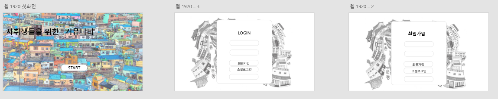
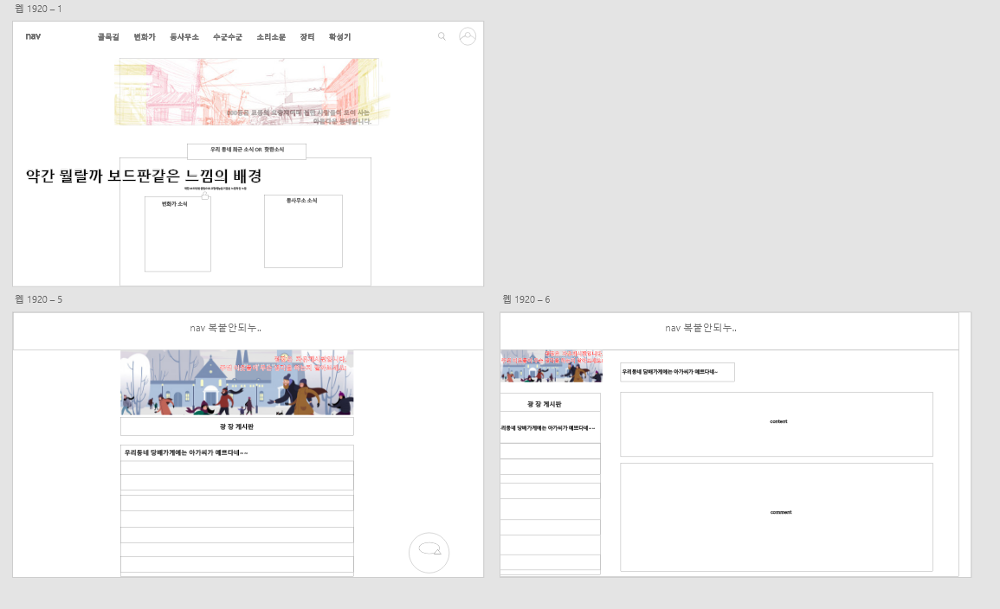
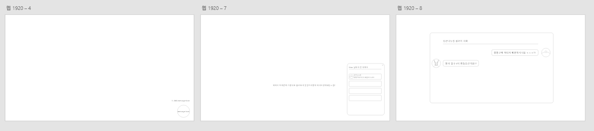
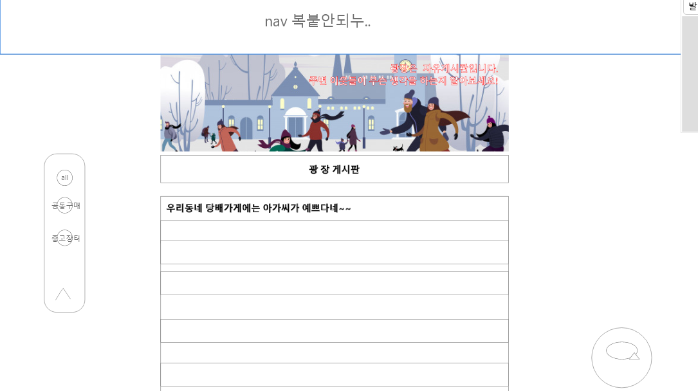
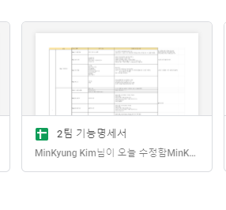
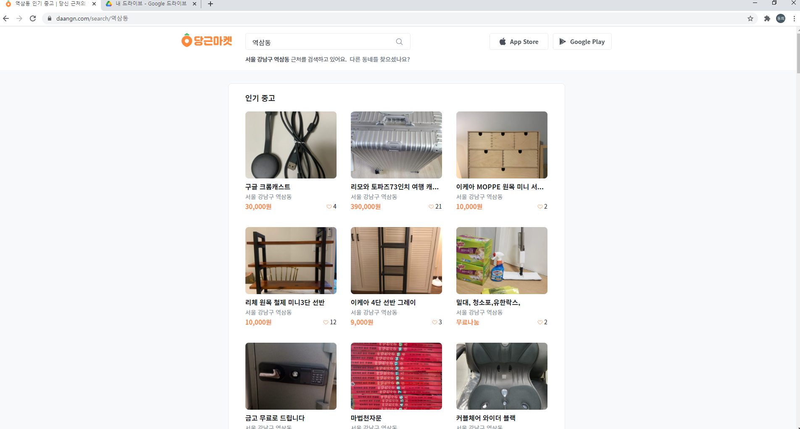
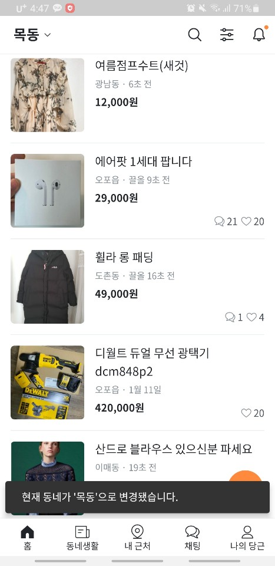
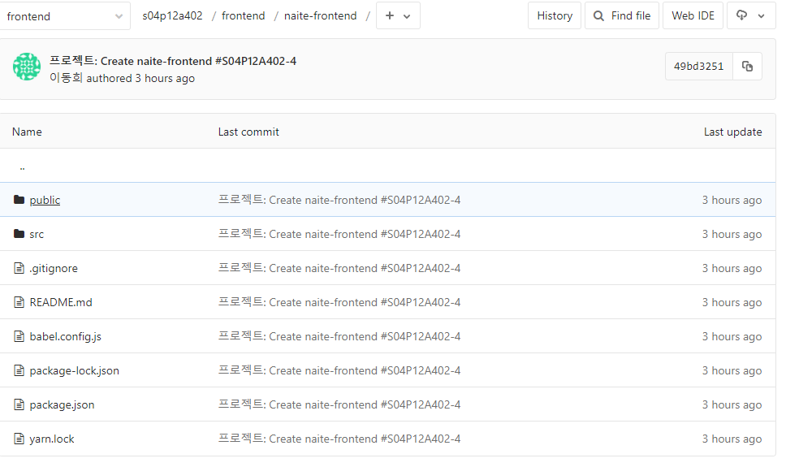

# Sub PJT 2

## front-end 회의

> 210118(월)

**와이어프레임** 설계

- 시작, 로그인, 회원가입
- 홈, 게시판, DM, 프로필

### 1) 1차 회의 결과물

#### (1) 시작,로그인,회원가입

> 플랫폼 첫 시작시 간략한 소개?제목과 함께 시작, 로그인과 회원가입 진행 시 아래의 사진과 같이 디자인(초안)
>
> -> 추후 논의를 통해 변경 예정!

##### (2) 홈,게시판,DM

> 아래의 이미지는 홈과 게시판 화면 초안
>
> 홈화면: 동네에 있는 게시판 같은 분위기로 생각, 클립보드에 붙어있는 전단지(?) 와 같은 느낌으로 진행
>
> 게시판: 게시판의 경우 각각의 게시판에 대한 설명게시 & 글의 제목 리스트를 나타냄
>
> ​				-> 게시물을 선택시 왼쪽으로 정렬되며 오른쪽 화면에는 상세 내용과 댓글들을 보여줄 예정

> DM혹은 채팅창의 경우 `fixed` 를 사용하여 오른쪽 하단에 고정
>
> 1) 클릭시 사각형으로 변화되며 현재 로그인된 사용자의 채팅방 목록을 보여줌
>
> 2) 채팅방 목록 중하나를 선택하면 해당 채팅방의 에전글들과 현재 대화를 할 수 있는 창으로 변환
>
> 3) x클릭시 이전 상태로 이동(채팅방->채팅목록->메세지아이콘) 순으로

### 2) 0119 계획

- 명세기반 기능 재확인
- 모바일 버전에 대한 회의 진행
- 시작 화면 및 로그인 회원가입 화면에 대한 피드백 회의

---

### 0119 (화)

- 로그인 사이트(소셜로그인 버튼사용)

  - 네이버 우선 나머지는 페이스북 카카오? 로고 배치

- 회원가입

  - 현재위치 기반하여 주변 동네를 보여줌 -> 자신의 그 중에 있는 자신의 동네를 선택하여 회원가입 진행

- 카테고리 어떻게 노출할지?

  - 1) 왼쪽에 있는 빈공간에 카테고리를 선택할 수 있는 박스?
  - 1-1) 게시물 정보를 보았을 때는 카테고리 박스가 안보이도록
  - 1-2) 게시물 정보를 보았을 때도 왼쪽에 공간을 만들어 박스가 보이도록 ( 직접 화면상에서 구현해보아서 비교할 예정)
  - 

- 장터게시판은 일반 게시판과는 다른 UI?

  - 기존 게시물과는 다르게 사진위주로 보여줌

  #### 참조 사이트

  1) 구글드라이브

  ​	- 간략한 사진과 밑에 간략한 정보들 표시

​		2)  당근마켓

​		- 구글드라이브 비슷한듯 아닌듯 전체적인 배치는 동일.

​	3) 당근마켓 어플

​	- 배치 좋음. 웹에 쓰기에는 허전할 것 같다? -> 2열로 배치?  

> 당근마켓 어플 배치와 2열 배치 진행예정
>
> -> 모바일 버전 전환시에도 편리할 듯! 굿굿굿

### 0120(수)

1) 프로젝트 생성

- vuex, vue-router, lodash,axios install 완료

2) 와이어프레임 마무리 작업

- 카테고리 세분화
- 명세기분 기능 세분화
- 회원가입 로그인 비밀번호 찾기 화면 제작
- 장터게시판 화면 제작
- 게시판 정보 세분화

